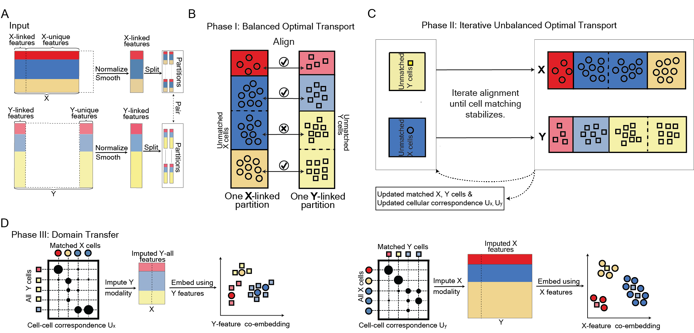

CelLink
===================================

**CelLink** is a Python for single-cell multi-omics integration, especially for datasets with weak feature linkage and imbalanced cell populations.
The link of the paper is https://www.biorxiv.org/content/10.1101/2024.11.08.622745v1

CelLink uniquely enables cell subtype annotation, correction of mislabelled cells, and spatial transcriptomic analyses by imputing transcriptomic profiles for spatial proteomics data. Its great ability to impute large-scale paired single-cell multi-omics profiles positions it as a pivotal tool for building single-cell multi-modal foundation models.

Check out the `Tutorial` section for its usage.

.. note::

   The new GPU-supported version will be released in the future.

Contents
--------

.. toctree::
   :maxdepth: 2
   
   tutorials/index.rst
  

.. toctree::
   :maxdepth: 2

   Installation
